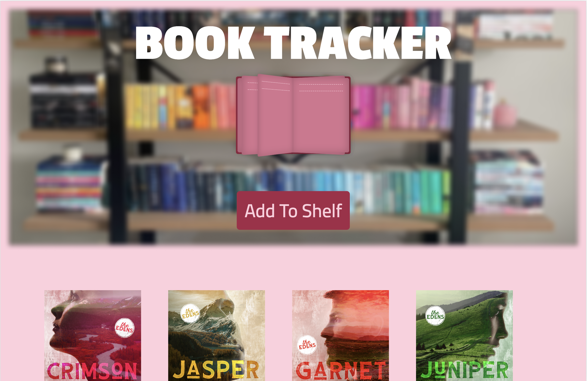
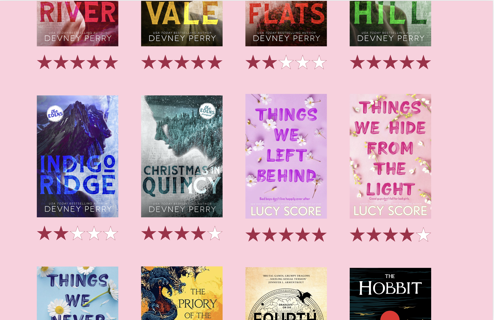
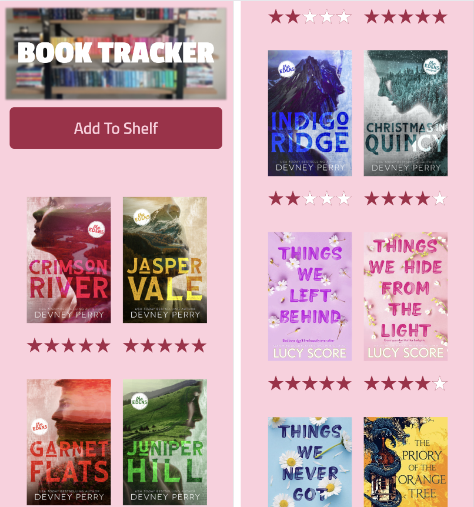
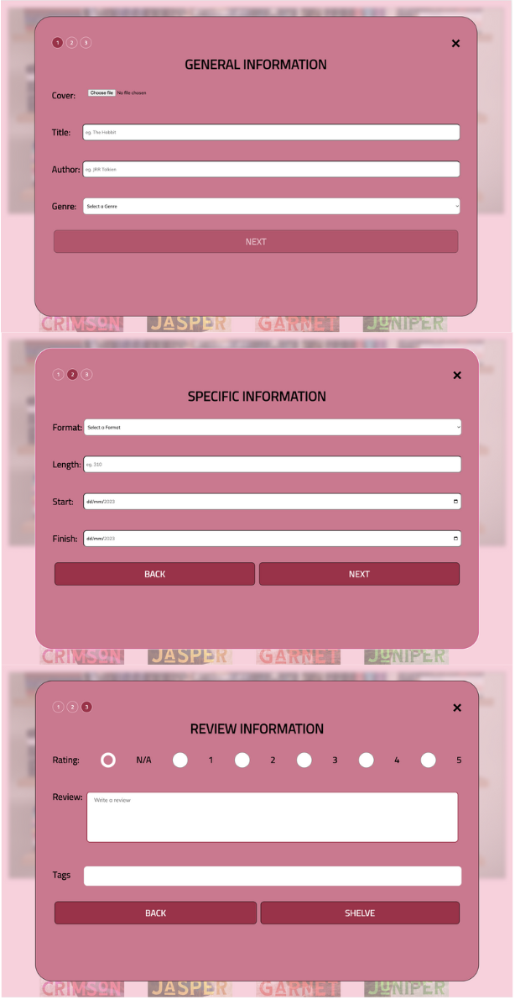
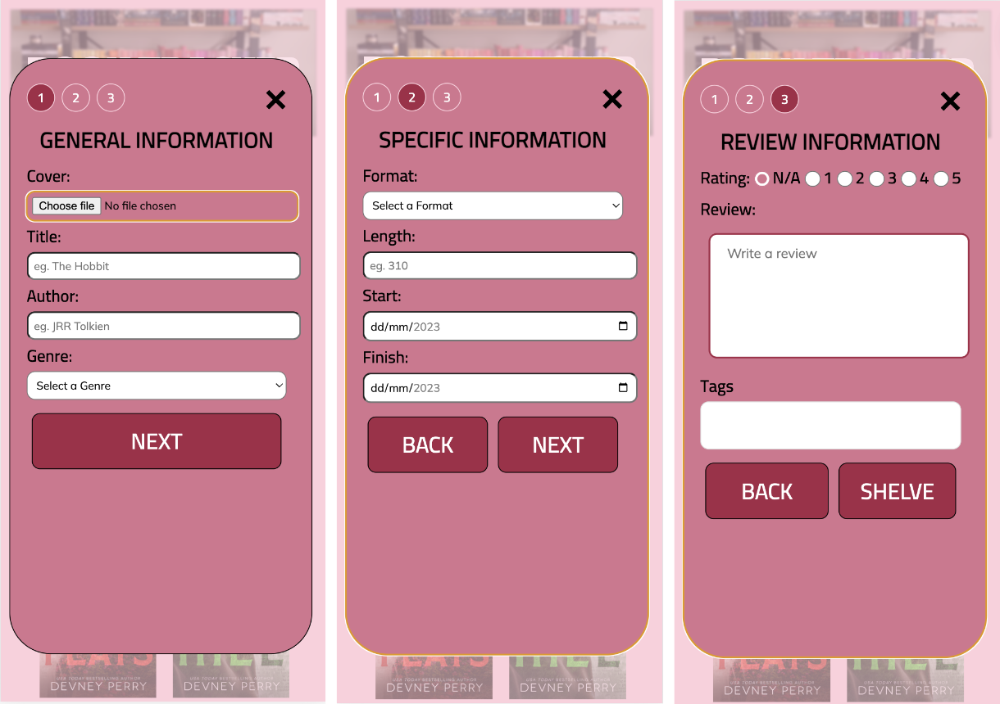
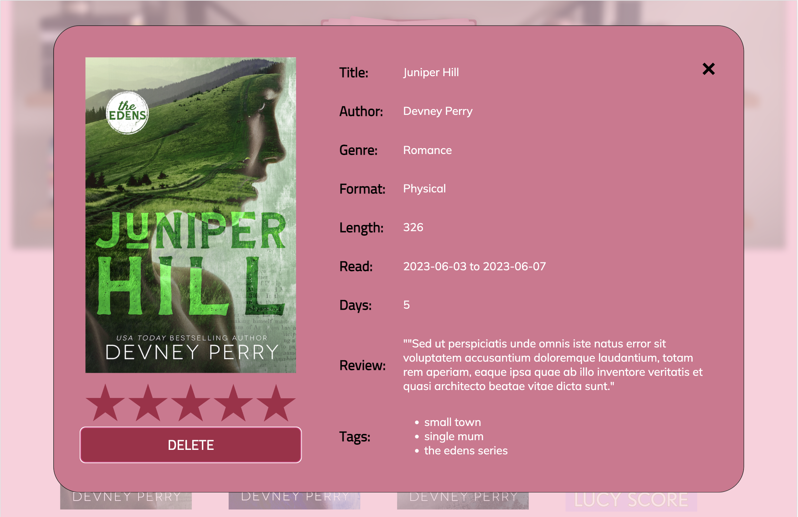
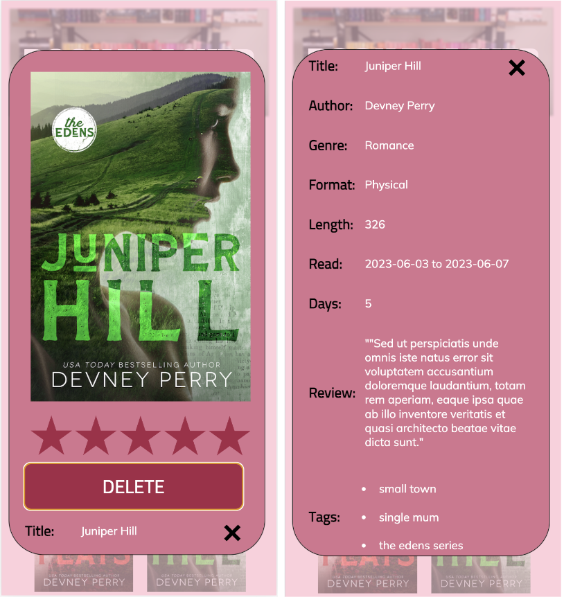
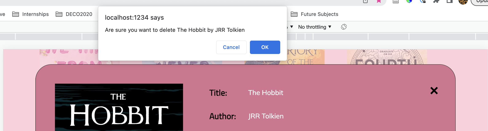

# Window Sizes
The window sizes that I based and tested the design on are: 
* Desktop: 1512 x 982 (Macbook Pro 14")
* Mobile: 390 x 844 (Chrome Dev Tools - iPhone 12 Pro)

<br>


# Outline of Application Configuration & Deployment Procedures 

## 1. Clone Repository
Use the below to clone to repo:
```
git clone https://github.com/emmcl/emcl8195-tracker.git
```
## 2. Download Node.js 
Download node.js from [Node.js](https://nodejs.org/en/download) <br>
You can check the version using 
```
node --version
```
 *Note: I am using v 18.6.0*

## 3. Install Dependencies
```
npm install
```
## 4. Start Server
Using one of the below options: <br>
1. For development environment
```
npm run dev
```
2. For production environment
 ```
npm run start
``` 
## 5. Open the application:
http://localhost:1234 (dev)<br>
http://localhost:8888 (prod) - taking approximately 2-3 minutes at the moment 

# How To Use

1. Click "Add To Shelf" 
2. Follow through the three steps of the form with relevant inputs <br> *(Please Note: I have included some book cover images in public/images if you would like to use those rather than look for your own.)*
4. Once shelved, you can click on any cover to see the inputed information.
3. From here, if you've made a mitstake or want to remove a book, click on it and press delete. A confirmation box will appear to check you are sure.  

# Development Process

The original designs including wireframes, mockups, and feature breakdown can be found [here](https://www.canva.com/design/DAFhYjicQp0/rhkTlwjHAHJAcwOhe61mZw/edit?utm_content=DAFhYjicQp0&utm_campaign=designshare&utm_medium=link2&utm_source=sharebutton)

While the development process will be best seen through my commit history, 

Some of the main issues I faced throughout the development processes included: 

1. Positioning/layers of the hero image, text and button - all fixed now, THANKS ROB!

2. Layout of the book covers once they were in the list - fixed by converting to CSS Grids. 

3. Radio Buttons not giving the expected values - [utilised :checked](https://stackoverflow.com/questions/9618504/how-to-get-the-selected-radio-button-s-value)

4. Tags coming through as a string (ugly) - [changed this to a list](https://getbutterfly.com/generate-html-list-from-javascript-array/)

5. Issues with being able to upload all files types - [changed to accept="image/x-png,image/gif,image/jpeg"](https://www.w3docs.com/snippets/html/how-to-allow-the-file-input-type-to-accept-only-image-files.html)

6. Date reading was not accurate - [found new method](https://stackoverflow.com/questions/3224834/get-difference-between-2-dates-in-javascript)

# Example Images From This Website 

I have included some screencaps to show how the website looks with data input into the form. As this is only design to use local storage for displaying the tracked data, this will start blank. 

## Main Page 
__Desktop__



__Mobile__


## Add Book Form 
__Desktop__


__Mobile__
 

## Information Modal 
__Desktop__


__Mobile__



## Other 

__Delete Confirmation__


# Design Principles & Patterns
Below I will outline the __design patterns__ featured on the website, from [ui-patterns.com](ui-patterns.com). 

## Input Prompt

## Pagination 
 
## Calendar Picker 

## Tagging 

## Additonal Features 
Additional features within the form that will be expected for the users include: <br>
### __Radio buttons__ <br>


### __Multi step form__ in __single column format__ <br>


# Accessibility 
## Colour Contrast 
The main text passes __WebAIM's Contrast Checker__ with a score of 6.75:1 which meets the required AA for this assignment:


## Alt Text
__Alt Text__ for images uploaded by the user is created dynamically with the title and author input by the user.

## Other 
__Semantic elements__ are used throughout the design.


# Iterations & Improvements

## General Changes
I added a finish date input as it is unrealistic to assume that the date the user adds the item to the tracker is neccessarily the date that they finished the book. 

## Feedback 
Based on previous assessment __feedback__, I have changed to a multi step form on desktop in the same way I had planned for in the mobile design. This will be both more visually appealing and more consitent for the user across web and mobile devices. Due to this, the layout of the form has changed slightly to make space for the 1-3 page indicator which is now included.   

## Removed Due to Scope/Time Restraints
1. I decided to simply use the built in confrm() function to prompt the user to confirm they want to delete the book, rather than the additional modal pop-up that was in my original designs. This built in function will be familiar to the user without taking away from the overall experience of the site.

2. I removed the originally planned book opening on hover as it was not working quite how I anticipated. I just changed this to have the cursor change when the books could be clicked on instead. 

3. I hid the opening book animation on the mobile version as I didn't want it to affect the loading on mobile. This also makes sense due to the hero image being smaller on mobile 

4. I originally planned to have a toast notification pop up when the user successfully shelved a book however, I decided this was unneccessary as the user will see the uploaded book cover appear at the top of the list. 


# Recommendations for Extensions & Improvements 

Due to time constraints I was not able to make this site overly responsive, I only picked two points of responsivity which were required. I would like to improve this and make it completely responsive.

Additionally, I would like to make this into a more expanded version, with the ability to search, filter and produce graphs and statistics based on the users data over a specific period of time, eg. at the end of the year. 

# Bugs 🪲
The form is not fully responsive between all sizes, please utilise the given sizes at the top of this file. 

The form has only been tested within Chrome, therefore I am unsure if there are any issues in other browsers. 

# References 

## The following are external code sources utilised within this project.

Ciprian. (2018). Generate HTML list from javascript array. Retrieved from https://getbutterfly.com/generate-html-list-from-javascript-array/

Dongas, R. (n.d.). Multistepform. Retrieved from https://replit.com/@DECO2017/MultiStepForm#index.html

Dongas, R. (2023). Upload image to base64. Retrieved from  https://codepen.io/robdongas/pen/dyggepJ

Ndugu, A. (n.d.). How to create a close button in HTML CSS. Retrieved from https://devpractical.com/close-button-html-css/

Stack Overflow. (n.d.). Get difference between 2 dates in javascript. Retrieved from https://stackoverflow.com/questions/3224834/get-difference-between-2-dates-in-javascript

Valeriia. (2016). Book opening animation (pure css). Retrieved from https://codepen.io/valerite-dev/pen/XjOeeK

Web Dev Simplified. (2023). Modal will never be the same - HTML dialog element. Retrieved from https://blog.webdevsimplified.com/2023-04/html-dialog/

Yair Even Or. (n.d.). Tagify. Retrieved from https://yaireo.github.io/tagify/


## The following were used for guidance with portion of code, not specific code.

Envato Tuts. (2016). How to build a responsive form with flexbox. Retrieved from https://webdesign.tutsplus.com/tutorials/building-responsive-forms-with-flexbox--cms-26767

Kavinda, S. (2020). How to style forms with css: A beginner's guide. Retrieved from https://blog.logrocket.com/how-to-style-forms-with-css-a-beginners-guide/

MDN Web Docs. (2023). < input type="date >. Retrieved from https://developer.mozilla.org/en-US/docs/Web/HTML/Element/input/date

Stack Overflow. (n.d.). How to get the selected radio buttons value. Retireved from https://stackoverflow.com/questions/9618504/how-to-get-the-selected-radio-button-s-value

W3 Docs. (n.d.). How to allow the file input type to accept only image files. Retrieved from https://www.w3docs.com/snippets/html/how-to-allow-the-file-input-type-to-accept-only-image-files.html

W3 Schools. (n.d.). HTML Form Elements. Retrieved from https://www.w3schools.com/html/html_form_elements.asp

W3 Schools. (n.d.). HTML forms. Retrieved from https://www.w3schools.com/html/html_forms.asp

W3 Schools. (n.d.) HTML Input Types. Retrieved from https://www.w3schools.com/html/html_form_input_types.asp


## The following are sources for the images included in the public/images folder.

Devney Perry. (n.d.). [Image] Retrieved from https://devneyperry.com/books/, covers for: 
* Christmas in Quincy 
* Indigo Ridge 
* Juniper Hill 
* Garnet Flats
* Jasper Vale 
* Crimson River 
* Sable Peak 

Lucy Score. (n.d.). [Image] Retrieved from https://www.hachette.com.au/lucy-score/, covers for: 
* Things We Never Got Over 
* Things We Hide From The Light
* Things We Left Behind

JRR Tolkien.. (n.d.). [Image] Retrieved from https://www.booktopia.com.au/the-hobbit-j-r-r-tolkien/book/9780261103344.html?source=pla&gclid=CjwKCAjw1YCkBhAOEiwA5aN4AT3AQ0_c4Qzb8yUFQb36Bl0bAynZ1ZKlWQGLswbQ8ApIpeK4WYcotRoCkBcQAvD_BwE


