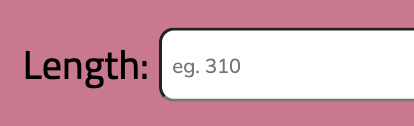
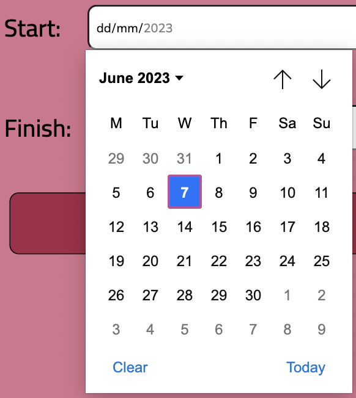
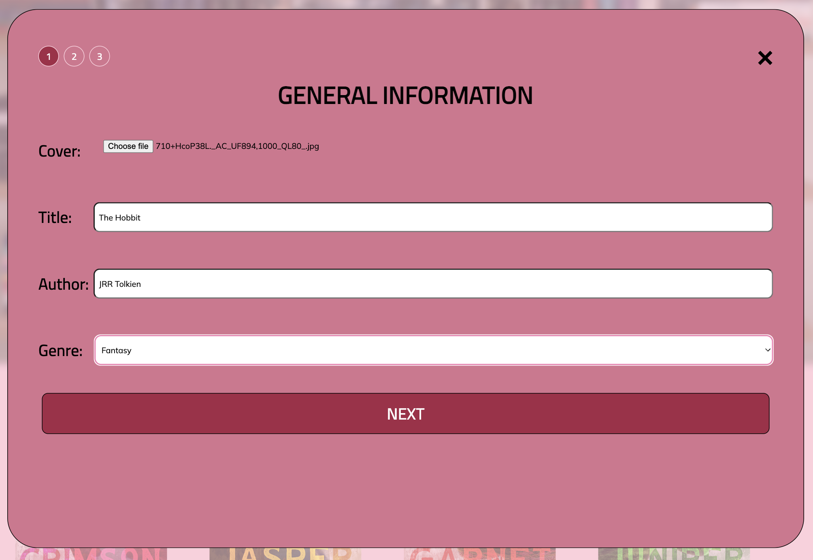
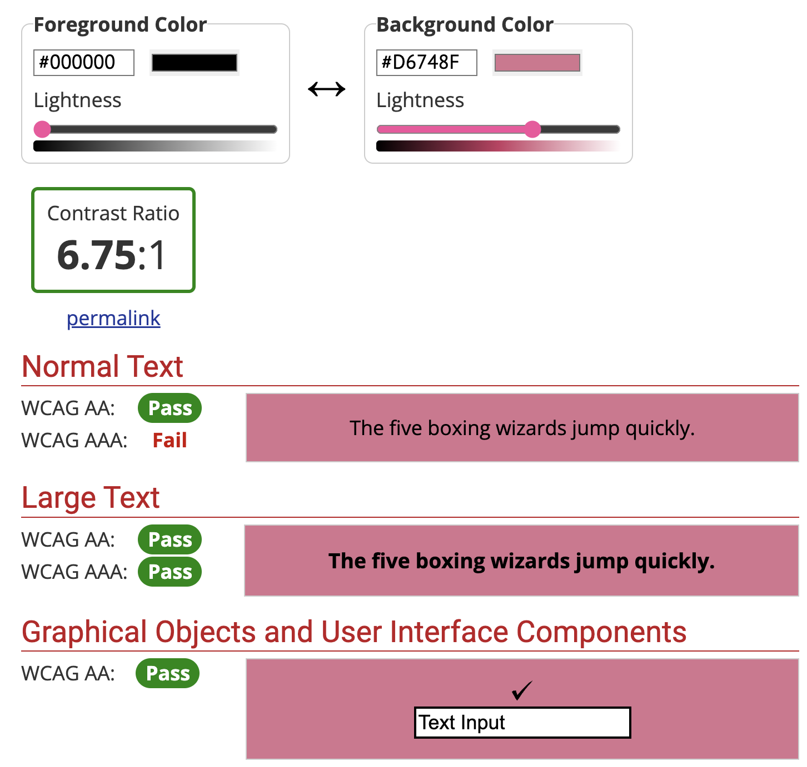

# WINDOW SIZES
The window sizes that I based and tested the design on are: 
* Desktop: 1512 x 982 (Macbook Pro 14")
* Mobile: 390 x 844 (Chrome Dev Tools - iPhone 12 Pro)

# OUTLINE OF APPLICATION CONFIGURATION & DEPLOYMENT PROCEDURES 

## 1. Clone Repository
Use the below to clone to repo:
```
git clone https://github.com/emmcl/emcl8195-tracker.git
```
## 2. Download Node.js 
Download node.js from [Node.js](https://nodejs.org/en/download) <br>
You can check the version using 
```
node --version
```
 __Note:__ I am using v 18.6.0

## 3. Install Dependencies
```
npm install
```
## 4. Start Server
Using one of the below options: <br>
1. For development environment
```
npm run dev
```
2. For production environment
 ```
npm run start
``` 
5. Open the application:
    * http://localhost:1234 (dev)
    * http://localhost:8888 (prod) - taking approximately 2-3 minutes at the moment 


# DEVELOPMENT PROCESS

# DESIGN PATTERNS & PRINCIPLES
__Design patterns__ (ui-patterns.com) featured on the website include:

## Input Prompt

## Pagination 
 
## Calendar Picker 

## Tagging 

## Additonal Features 
Additional features within the form that will be expected for the users include:
* radio buttons 

* __Multi step form__ in __single column format__



# ACCESSIBILITY 
## Alt Text 
* The main text passes __WebAIM's Contrast Checker__ passes the required AA for this assignment: 

* __Alt Text__ from imags - created dynamically with the title and author input by the user
* Utilised a 


# ITERATIONS & IMPROVEMENTS 

* Based on previous assessment feedback, I have changed to a multi step form on desktop as well as mobile. This will be both more visually appealing and more consitent for the user across web and mobile devices.  


* Changed layout of form slightly to adjust for the 1,2,3 page indicator for mutli step form - had to move close button 

* Added finish date input as it is unrealistic to assume that the input date is neccessarily the finish date


# RECOMMENDATIONS FOR IMPROVEMENTS OR EXTENSIONS

Due to time constraints I was not able to make this site overally responsive, I only picked two points of responsivity which were required. I would like to improve this and make it completely responsive.

Additionally, 

# REFERENCES 

## The following are external code sources utilised within this project: 

Ciprian. (2018). Generate HTML list from javascript array. Retrieved from https://getbutterfly.com/generate-html-list-from-javascript-array/

Dongas, R. (n.d.). Multistepform. Retrieved from https://replit.com/@DECO2017/MultiStepForm#index.html

Dongas, R. (2023). Upload image to base64. Retrieved from  https://codepen.io/robdongas/pen/dyggepJ

Ndugu, A. (n.d.). How to create a clos ebutton in HTML CSS. Retrieved from https://devpractical.com/close-button-html-css/

Stack Overflow. (n.d.). Get difference between 2 dates in javascript. Retrieved from https://stackoverflow.com/questions/3224834/get-difference-between-2-dates-in-javascript

Valeriia. (2016). Book opening animation (pure css). Retrieved from https://codepen.io/valerite-dev/pen/XjOeeK

Web Dev Simplified. (2023). Modal will never be the same - HTML dialog element. Retrieved from https://blog.webdevsimplified.com/2023-04/html-dialog/

Yair Even Or. (n.d.). Tagify. Retrieved from https://yaireo.github.io/tagify/


## The following were used for guidance with portion of code, not specific code. 

Envato Tuts. (2016). How to build a responsive form with flexbox. Retrieved from https://webdesign.tutsplus.com/tutorials/building-responsive-forms-with-flexbox--cms-26767

Kavinda, S. (2020). How to style forms with css: A beginner's guide. Retrieved from https://blog.logrocket.com/how-to-style-forms-with-css-a-beginners-guide/

MDN Web Docs. (2023). < input type="date >. Retrieved from https://developer.mozilla.org/en-US/docs/Web/HTML/Element/input/date

Stack Overflow. (n.d.). How to get the selected radio buttons value. Retireved from https://stackoverflow.com/questions/9618504/how-to-get-the-selected-radio-button-s-value

W3 Docs. (n.d.). How to allow the file input type to accept only image files. Retrieved from https://www.w3docs.com/snippets/html/how-to-allow-the-file-input-type-to-accept-only-image-files.html

W3 Schools. (n.d.). HTML Form Elements. Retrieved from https://www.w3schools.com/html/html_form_elements.asp

W3 Schools. (n.d.). HTML forms. Retrieved from https://www.w3schools.com/html/html_forms.asp

W3 Schools. (n.d.) HTML Input Types. Retrieved from https://www.w3schools.com/html/html_form_input_types.asp


